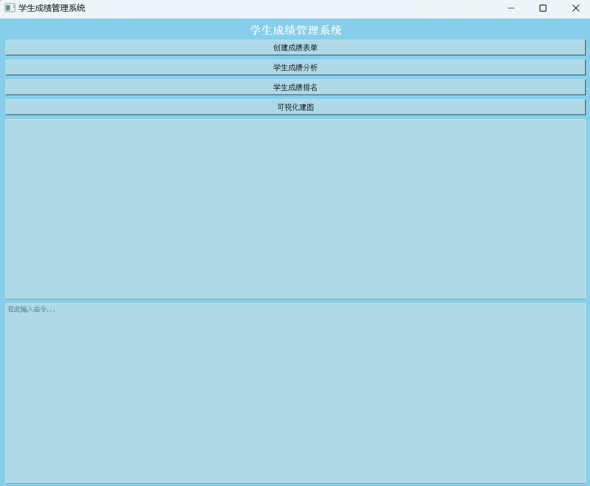
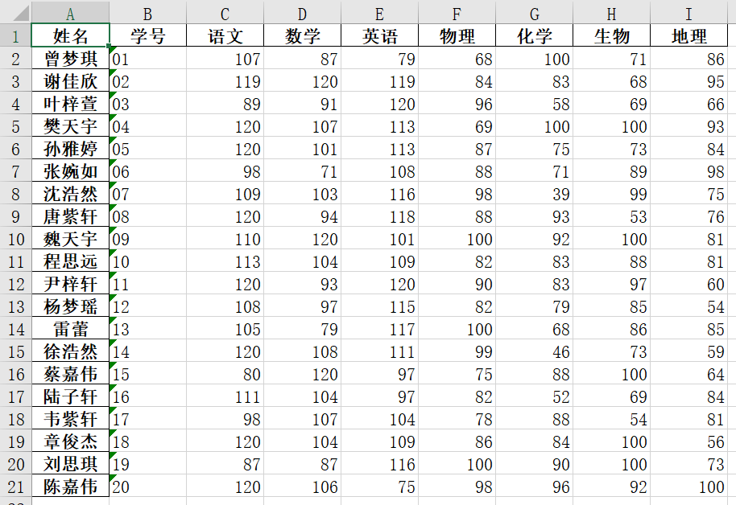
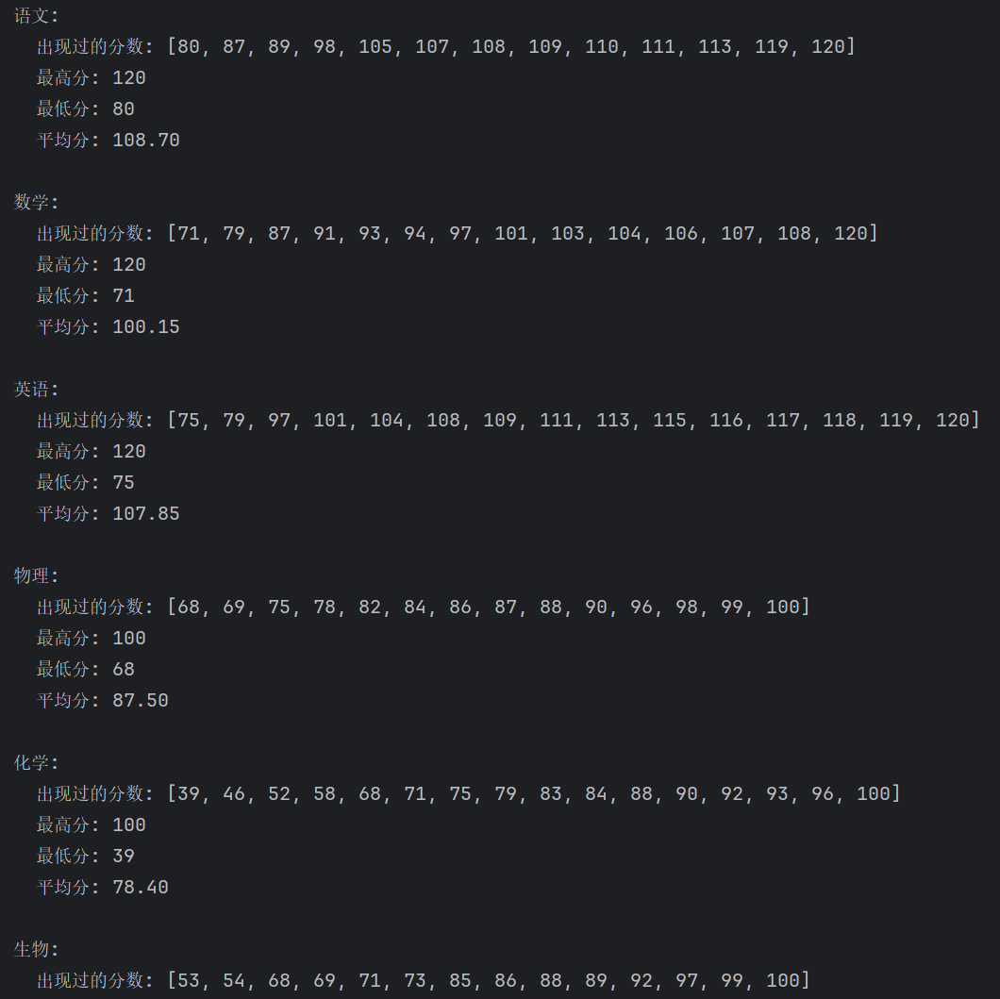
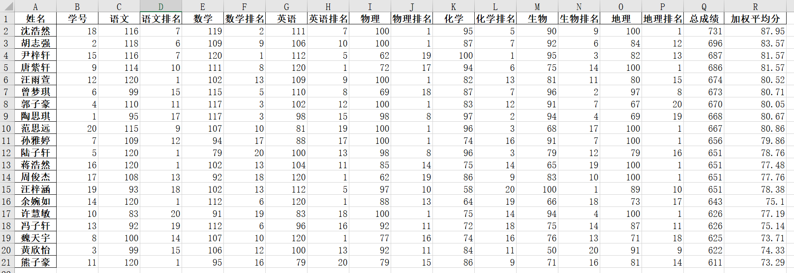
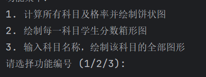
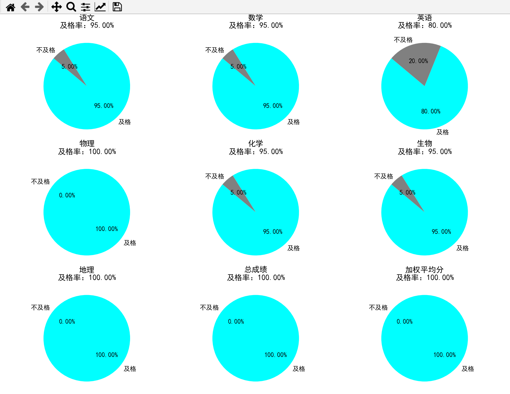
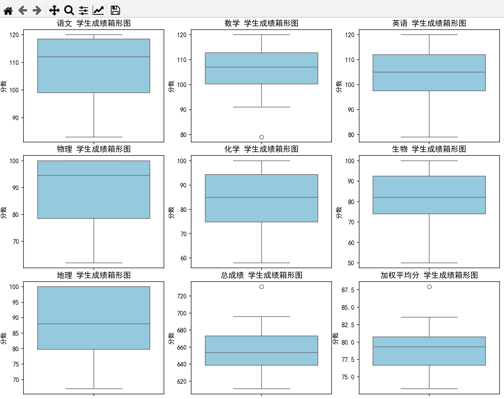
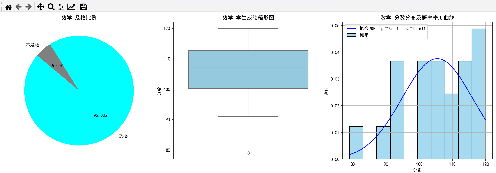

<a><b>学生成绩管理系统</b></a>

**最终成果在Qt展示，运行main.py即可**

**4.3需要先后输入“3”,“数学”**  <-指任意科目
，输入栏没有文字显示是正常现象(~~其实就是解决不了了~~)

以下分别介绍几个python文件的内容和功能

### 一、[build_score.py](build_score.py)
使用一个元组将人名初始化，之后随机选择20个不重复学生名字(~~姓名是胡编乱造的~~），

利用random包对应生成七科成绩：

语数英：均值105，标准差15，范围[0, 120]

物化生地：均值85，标准差15，范围[0, 100]

导出的excel文件命名为student_scores.xlsx

### 二 、[score_analysis.py](score_analysis.py)
这里利姓名为索引读取一中创建的数据，之后是常规数据分析，

出现过的所有分数(分数相同者只计一次)、最高分、最低分、平均分。

### 三、[student_analysis.py](student_analysis.py)
任务三设计为重新读取build_score中生成的数据，

为解决每科总分不一致的问题，先给出总分最高的学生，

后将成绩换算为百分制后比较加权平均分（~~比平均分太抽象了还是比总分好了~~）

`.rank 排名
.extend 使每科成绩后紧跟其排名
.sort 降序排序`

导出的excel文件命名为student_ranks.xlsx

### 四、[Visualization.py](Visualization.py)

首先解决matplotlib不支持中文的问题

`plt.rcParams['font.family'] = 'SimHei'`

由于需要大量绘图，考虑先构造函数完成例如一科饼状图、箱型图等，最后再集成，

同时加入了总成绩，加权平均分的考量，以九宫格形式输出

用户可输入数字获得想要的数据：

具体图形列表如下：

做到这里其实应该提升部分科目难度，比如降低数学的均值，以符合真实情况。

